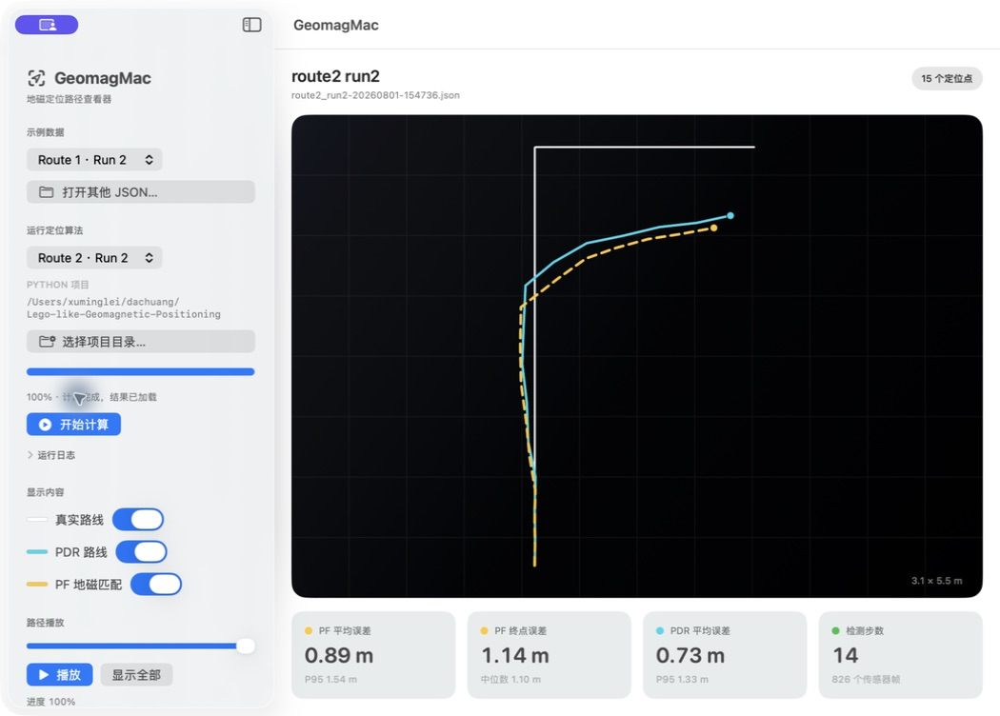

# GeomagMac

GeomagMac 是 `Lego-like-Geomagnetic-Positioning` 的原生 macOS 路径查看器。
当前版本把 `xuml-v7-optimization` 分支的修改版定位算法、Python 运行时、依赖和自采数据一起打包进 App，运行时不需要另外安装 Python，也不依赖原项目目录。

> 实时计算和参数预设依赖 `xuml-v7-optimization` 分支新增的算法参数。仓库的 `main` 分支也保留 App 源码和示例查看功能，但构建内置实时后端前应先切换到 `xuml-v7-optimization`。



## 运行

1. 使用 Xcode 打开 `GeomagMac.xcodeproj`。
2. 选择 `GeomagMac` scheme 和 `My Mac`。
3. 点击 Run，或按 `Command-R`。

应用内置三组演示结果，也可以通过“打开其他 JSON…”读取 Python 项目生成的结果。

## 当前功能

- 白色真实路线、青色 PDR 路线、黄色虚线 PF 路线
- 三条路线独立显示/隐藏
- 路径逐步播放与进度拖动
- 触控板缩放、鼠标拖动、双击复位
- PF/PDR 平均、P95、中位数和终点误差
- 支持读取现有结果 JSON
- 在 App 内选择 `route1_run2`、`route2_run1` 或 `route2_run2` 并运行 Python 算法
- 支持选择任意手机采集文件夹，自动校验三路传感器 CSV 并运行当前修改版算法
- 自动识别有效行走区间，忽略开始前和到达终点后的静止记录
- 运行前给出采样率、时间断点、三路重叠、磁场异常和传感器量程的数据质量评级
- 运行前校验真实路线是否落在地图范围内，并逐点标出越界坐标
- 显示经过核心粒子范围与磁场信息量校准的 PF 可靠度、95% 粒子范围和置信分数
- 连续低可靠时提示定位歧义；持续失效时自动扩大搜索或重新初始化粒子，并在路径上标记恢复点
- 区分磁力计无效、可信起点不一致和陀螺仪持续偏置：无效磁场帧暂停匹配，错误起点立即回锚，异常航向改用偏置补偿后的相对传播
- 在结果页显示“传感器降级”“起点重新初始化”“航向重新定位”等具体状态，PNG/CSV 导出同步保留恢复事件
- 支持填写真实路线、初始航向，并可选择自定义 NPZ 地磁地图
- 默认运行 App 内置的修改版算法后端；缺少内置后端时自动回退到外部 Python 开发模式
- 显示实时进度和完整日志，支持复制日志、清空日志与取消计算
- 提供算法参数预设、自定义参数和自动持久化
- 点击“导出 PNG/CSV…”选择文件夹，同时导出当前轨迹图和坐标数据
- 计算结果保存在 `~/Library/Application Support/GeomagMac/Runs/`，可从历史列表重新加载或在 Finder 中查看

## 图形界面验证

2026-08-01 使用独立目录版和仓库目录版完成了原生界面回归测试：

- 软件启动、三个内置示例切换以及真实/PDR/PF 路线显隐正常。
- 播放、暂停、进度恢复、缩放复位和 PF 置信范围正常。
- 从界面运行内置 `route2_run2` 后端成功，结果自动进入历史列表；PF 平均误差为 `0.893 m`，终点误差为 `1.136 m`，与命令行基线一致。
- 手动加载压力测试 JSON 后，起点重新初始化会显示“自动恢复”提示和紫色恢复标记。
- 文件夹选择器可以同时导出 1600 × 1000 PNG 与 CSV，导出图片、坐标和可靠度字段均已检查。

Xcode/系统日志中的 `com.apple.linkd.autoShortcut` 是 macOS App Intents 服务在部分调试环境中的系统提示，不影响定位、导出或结果加载。本轮未再出现 SwiftUI 的 `Publishing changes from within view updates`，也没有生成崩溃报告。首次启动内置后端时 Matplotlib 可能建立字体缓存，因此第一次计算会比之后稍慢。

## 导入新的采集数据

在“运行定位算法”中将数据来源切换为“导入采集文件夹”，然后点击“选择采集文件夹…”。可以直接选择一组采集目录，也可以选择只包含一组采集目录的上级文件夹。每组数据至少需要：

- `Accelerometer.csv`
- `Gyroscope.csv`
- `Magnetometer.csv`

App 会在运行前检查文件是否存在、表头是否符合算法要求、有效数值行数是否足够，以及三路传感器时间范围是否重叠。它还会估计三路采样率、缺帧/长时间断点、磁场突变和可能的传感器饱和，并给出“可用”“需注意”或“不建议使用”的质量评级。`Location.csv` 是可选文件，当前定位算法不依赖手机 GPS。

根据加速度和角速度，App 会自动估计实际行走的起止时间。导入数据运行时会只把高可信活动区间送入算法，从而排除出发前和终点后的静止数据；界面会显示保留的帧数、时长和检测可信度。

传感器校验完成后还需要填写：

- **数据集名称**：用于结果 JSON、PNG 和历史记录命名。
- **真实路线坐标**：格式为 `x1,y1; x2,y2; ...`，单位为米。坐标必须与地磁地图采用同一坐标系。
- **初始航向**：可选，使用数学角度；留空时根据路线前两个点自动计算。
- **地磁地图**：默认使用与现有路线坐标一致的内置砖块地图，也可以选择包含二维标量网格和范围信息的 NPZ 地图。

外部文件夹只决定传感器文件从哪里读取，不会切换到旧版算法参数。App 会使用与内置基准相同的 `package` 优化配置，并在新导入一组数据时恢复“当前优化基线”（关闭航向网格约束）。内置地图会在界面中即时检查路线范围；自定义 NPZ 地图会由后端在进入传感器计算前检查。坐标系不匹配时会停止运行并显示具体越界点。

采集文件夹可以放置可选的 `geomag_dataset.json`，让 App 自动填充配置：

```json
{
  "dataset_key": "route3_run1",
  "route_xy_m": [[1.44, 0.55], [1.44, 8.25], [5.28, 8.25]],
  "initial_heading_deg": 90.0,
  "map_npz_path": "map.npz"
}
```

运行时 App 会把导入目录、路线、地图、参数预设和算法输出写入日志。计算失败时，错误弹窗会附带最后几行后端信息；“查看完整日志”可以打开可滚动、可复制的日志窗口。

“结果管理”显示最近五次运行。点击记录会重新加载结果，放大镜按钮会在 Finder 中定位 JSON；“打开结果目录”可查看全部 JSON、轨迹 PNG 和诊断图。

## 导出结果

结果页右上角提供“导出 PNG/CSV…”按钮。选择目标文件夹后，App 会使用数据集名称和当前时间生成两个文件：

- `数据集-时间.png`：1600 × 1000 的原生轨迹图，包含真实路线、PDR、PF、PF 置信范围、图例和主要误差指标。
- `数据集-时间.csv`：统一的长表格式；除 `series,index,x_m,y_m` 外，PF 行还包含 95% 半径、核心 80% 半径、磁场信息量、可靠度、定位状态和恢复动作。

PNG 由 App 根据当前 JSON 原生重绘，因此内置示例、手动打开的 JSON 和刚完成的算法结果都可以导出，不依赖原 Python 输出图片。

## 算法参数与预设

侧边栏“算法参数”包含三个预设和一个自定义模式：

- **当前优化基线**：默认选项，与现有三组基准结果保持一致，航向不做网格约束。
- **90° 受控路线**：将航向约束到 90° 网格，只适合当前沿砖缝直线行走、直角转弯的精度测试，不应直接用于一般室内路线。
- **原始 PF（不平滑）**：关闭显示轨迹平滑，用于观察粒子滤波原始抖动。
- **自定义**：可以调整 PF 平滑方式与权重、航向网格约束、步长比例、PF 联合校准及实验性三轴矢量地图。

修改任一参数后会自动切换到“自定义”。预设和自定义参数都会保存在本机，下次启动继续使用；点击“恢复当前优化基线”可以回到安全默认值。计算开始后参数会锁定，实际使用的参数同时写入运行日志和结果 JSON。

在 `route2_run2` 上的验证结果：

| 预设 | PF 平均误差 | PF 终点误差 | PDR 平均误差 |
| --- | ---: | ---: | ---: |
| 当前优化基线 | 0.893 m | 1.136 m | 0.732 m |
| 90° 受控路线 | 0.854 m | 1.390 m | 0.688 m |

90°约束降低了这组数据的平均误差，但终点误差反而增大，因此它作为实验预设保留，不替代默认基线。

## 构建内置算法后端

首次构建或算法代码变化后，在 `GeomagMac` 目录运行：

```bash
../.venv/bin/python -m pip install -r Backend/requirements-build.txt
./Scripts/build_backend.sh
```

上面的路径适用于仓库内的 `GeomagMac/` 目录。脚本也支持将
`GeomagMac` 和 Python 仓库并列放置；如果使用其他布局，可通过下方环境变量指定路径。

脚本会生成 `BackendDist/GeomagBackend/`。Xcode 将整个目录复制进 `GeomagMac.app/Contents/Resources/GeomagBackend/`。当前 arm64 后端约 108 MB，包含：

- `xuml-v7-optimization` 分支的当前修改版算法
- Python 解释器与 NumPy、SciPy、Matplotlib 等依赖
- `route1_run2`、`route2_run1`、`route2_run2` 所需数据和地图

如果原算法项目不在相邻目录，可设置：

```bash
GEOMAG_PYTHON_PROJECT=/path/to/Lego-like-Geomagnetic-Positioning \
GEOMAG_PYTHON_BIN=/path/to/python \
./Scripts/build_backend.sh
```

## 外部 Python 开发模式

如果尚未生成 `BackendDist/GeomagBackend`，App 会回退到外部 Python。默认项目目录是 `~/dachuang/Lego-like-Geomagnetic-Positioning`，也可以在侧边栏选择包含 `main.py` 的目录。

点击“开始计算”后，App 等价执行：

```bash
python3 -u main.py --branch own --own route1_run2 --no-show \
  --output-json <App运行目录>/result.json \
  --output-png <App运行目录>/result.png
```

`run.sh` 和 Bokeh 网页入口仍然保留，但原生 App 的正式运行路径不再经过它们。

## 后续阶段

- 对 App 和内置后端做 Developer ID 签名、公证与发布打包
